# SSAFY 10기 7반 E조 최종 관통 프로젝트

---

# 스케치볼⚾

## 목차

- [팀원 소개](#팀원-소개)
- [프로젝트 소개](#프로젝트-소개)
  - [목표](#목표)
  - [요구 사항](#요구-사항)
  - [프로젝트 개요](#프로젝트-개요)
  - [기술 스택](#기술-스택)
    - [Environment](#environment)
    - [Development](#development)
    - [Communication](#communication)
  - [설계 전략](#설계-전략)
    - [피그마](#피그마)
    - [명세서](#명세서)
    - [ERD](#erd)
- [주요 기능](#주요-기능)
- [화면 구성 💻](#화면-구성-)
- [아키텍쳐](#아키텍쳐)
  - [디렉토리 구조](#디렉토리-구조)
  - [주요 기능 코드](#주요-기능-코드)
- [느낀점](#느낀점)
- [기타](#기타)
  - [COMMIT RULES](#commit-rules)

## 팀원 소개

<table align="center">
    <tr align="center">
        <td style="min-width: 250px;">
            <a href="https://github.com/KuMMii">
              <b>김지은</b>
            </a> 
        </td>
        <td style="min-width: 250px;">
            <a href="https://github.com/JHyeon-a">
              <b>정현아</b>
            </a>
        </td>
    </tr>
    <tr align="center">
        <td style="min-width: 250px;">
              
        </td>
        <td style="min-width: 250px;">
              
        </td>
    </tr>
    <tr align="left">
        <td>
        Front-end
        <br/>
        1. Diary 등록 / 조회 / 수정 / 삭제 화면 구현<br>
        2. 승리요정 화면 구현<br>
        3. 이미지 업로드 구현<br>
        4. 화면 캡쳐 기능 구현<br>
        5. 카카오톡 공유하기 API 활용<br>
        <br>
        Back-end
        <br>
        1. DB 모델링<br>
        2. Diary / 승리요정 / 달력 - Dto / Dao / Service / Controller / Mapper.xml 구현<br>
        3. 이미지 업로드 구현<br>
        4. 주간 달력 구현
        </td>
        <td>
        Front-end
        <br/>
        1. Vue 프로젝트 구조 생성<br>
        2.  User 등록 / 조회 / 수정 / 삭제 화면 구현<br>
        3.  Home 화면 구현<br>
        4.  모아보기 화면 구현<br>
        5.  마이페이지 화면 구현<br>
        6.  회원가입, 로그인 화면 구현<br>
        7.  vue 라우터 및 파일 구성<br><br>
        Back-end
        <br>
        1.  DB 모델링<br>
        2.  User - Dto / Dao / Service / Controller / Mapper.xml 구현<br>
        <br/>
        </td>
    </tr>
</table>

## 프로젝트 소개

### 목표

- 웹 아키텍처를 이해하고 이를 활용하여 웹 프로젝트를 설계하고 구현
- SpringBoot와 Vue를 이해하고 활용
- Rest API와 VueRouter을 활용하여 SPA 방식으로 프로젝트를 구성
- 기존 관통 프로젝트에 새로운 아이디를 추가하여 과정에서 배운 기술들을 다양하게 구현

### 요구 사항

- 기존 진행한 관통 프로젝트의 요구사항을 정리하고 페어 별로 프로젝트에 적용할 아이디어를 추가하여 Final Project를 완성
- SpringBoot와 MyBatis연동을 활용한 RestAPI 서버 구현
- Vue3버전을 활용한 SPA 클라이언트 구현

### 프로젝트 개요

- 프로젝트 이름 : 스케치볼 ⚾
- 프로젝트 기간 : 2023.11.16~11.24
- 주제 : 야구 관람 일기
- 개발 목적 : 야구를 보는 사람들을 위해 만든 서비스로, 야구 경기에 대한 나만의 일기를 적을 수 있다. 야구가 대한민국 3대 구기 종목 중 하나인 만큼 팬도 많고 시장도 크지만 야구 관람에 대해 적는 마음에 드는 서비스가 없어 이것으로 주제를 정했다.

### 기술 스택

#### Environment


#### Development


#### Communication


### 설계 전략

#### 피그마

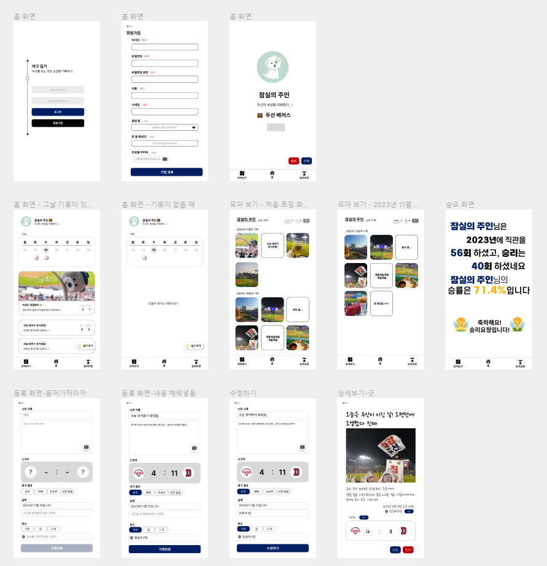

#### 명세서

[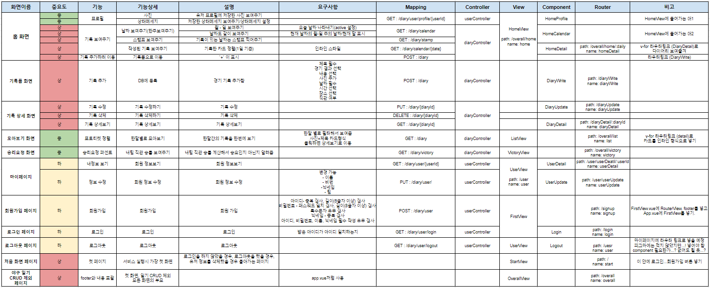](https://github.com/ssafy10-seoul07/PJT-FINAL-E-KJE-JHA/assets/128502524/63cfec48-d238-484c-bc26-757bfff514cb)

#### ERD

[](https://github.com/ssafy10-seoul07/PJT-FINAL-E-KJE-JHA/assets/128502524/18d95e77-02d4-4104-b3b5-8d3df1041e77)

#### Class Diagram

- **Diary**
  [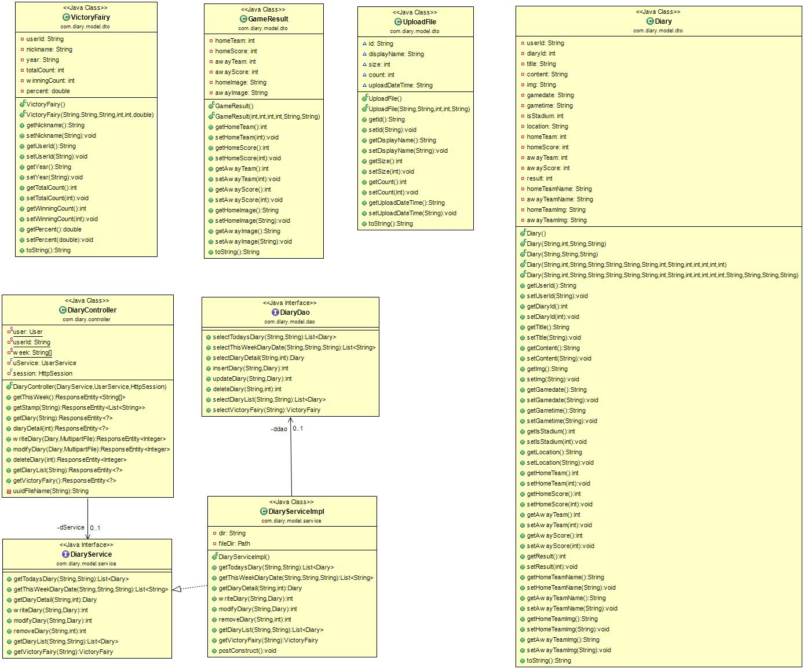](https://github.com/ssafy10-seoul07/PJT-FINAL-E-KJE-JHA/assets/128502524/fa88c4bd-39be-4285-b73e-f6fd17727656)
- **User**
  [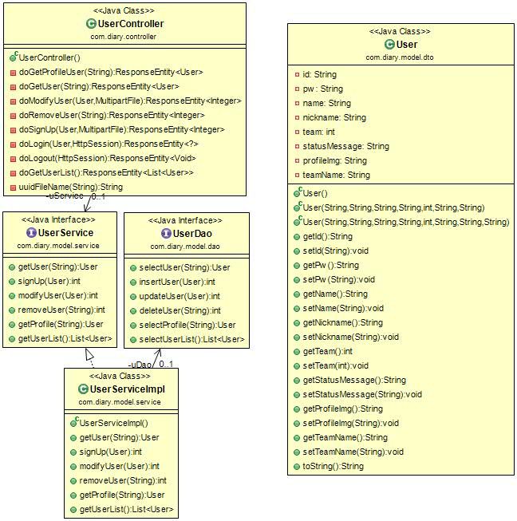](https://github.com/ssafy10-seoul07/PJT-FINAL-E-KJE-JHA/assets/128502524/db7d113a-ea18-4fe3-be34-64385319f3c8)

## 주요 기능

- **주간 일정 중 일기가 있는 날 스탬프 표시**<br>
- **전체 및 기간 선택 후 모아보기**<br>
- **유저, 일기 CRUD**<br>
- **승리요정 분석**<br>
- **화면 캡쳐 후 이미지 다운로드**<br>
- **카카오톡 공유하기**<br>

## 화면 구성 💻

⭐ 홈

- 회원가입, 로그인

[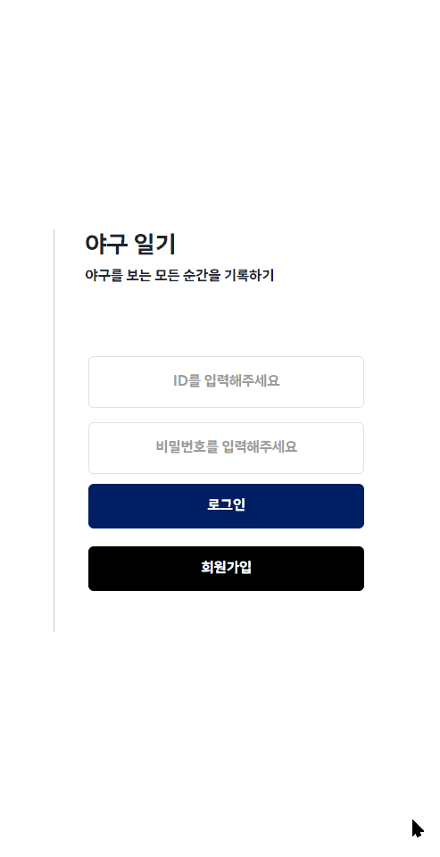](https://github.com/ssafy10-seoul07/PJT-FINAL-E-KJE-JHA/assets/128502524/96e5c550-f01a-443a-a333-465e7d6640f6)

- 일기 작성하기

[](https://github.com/ssafy10-seoul07/PJT-FINAL-E-KJE-JHA/assets/128502524/18fa8087-27af-43f8-bedd-2afaaaa2cb63)

- 일기 상세보기 / 수정 / 삭제 / 캡쳐 이미지 저장

[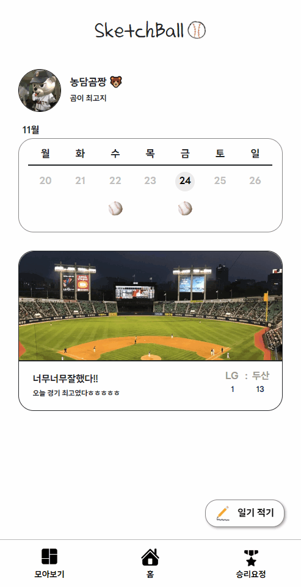](https://github.com/ssafy10-seoul07/PJT-FINAL-E-KJE-JHA/assets/128502524/1a2113a8-9928-4d94-a20b-eaa58f5c5aa7)

⭐ 모아보기

- 전체 기간, 원하는 달을 선택해 일기를 모아볼 수 있다.

[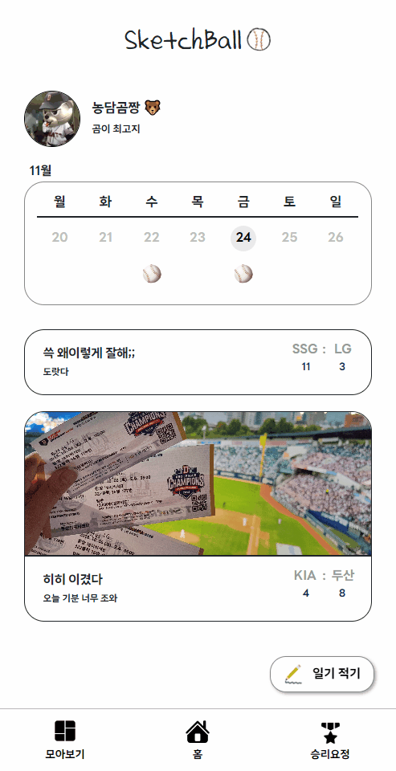](https://github.com/ssafy10-seoul07/PJT-FINAL-E-KJE-JHA/assets/128502524/e73d5f96-7404-4c08-805b-2b5a284bf73a)

⭐ 승리요정

- 직관 횟수와 직관 승리 횟수를 계산해 승리 퍼센트를 구한다. 70% 이상이면 승리요정, 미만이면 패배요정이다.
- 저장 버튼을 누르면 화면을 캡쳐해 로컬에 저장한다.
- 카카오톡 공유하기 버튼을 눌러 공유가 가능하다.

[](https://github.com/ssafy10-seoul07/PJT-FINAL-E-KJE-JHA/assets/128502524/7f41674e-1487-4ff2-9839-72a6516a2efc)

- 마이팀을 선택하지 않을 때의 승리요정 화면

[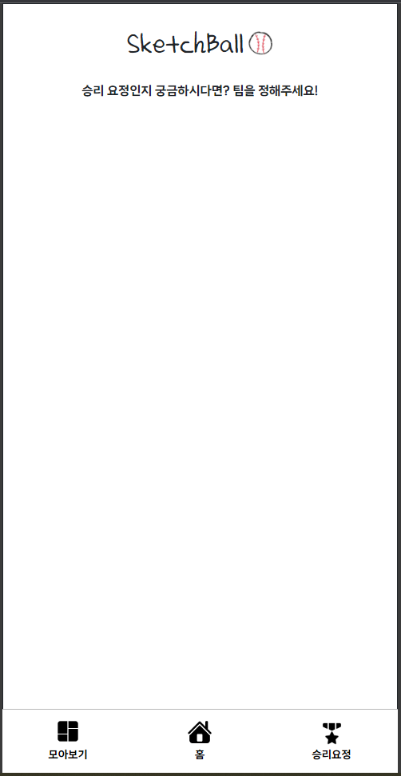](https://github.com/ssafy10-seoul07/PJT-FINAL-E-KJE-JHA/assets/128502524/2ee51c04-d4df-4f30-bb23-b16a26d8ff5a)

- 팀은 선택했지만 직관 기록이 없을 때의 승리요정 화면

  [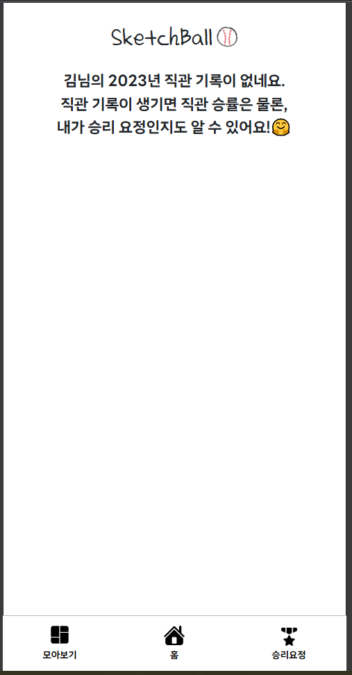](https://github.com/ssafy10-seoul07/PJT-FINAL-E-KJE-JHA/assets/128502524/133543b9-143c-42cb-b098-37014d011e4e)

- 승리요정일 때의 화면

  [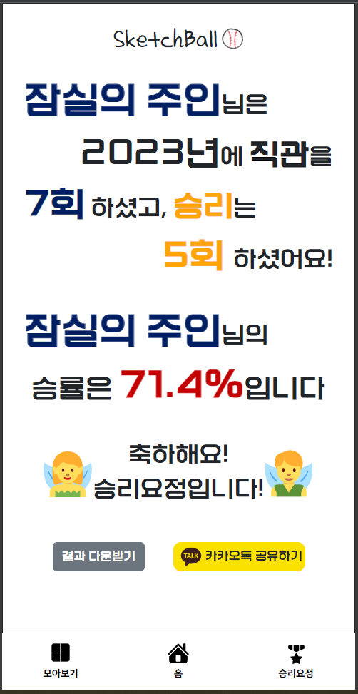](https://github.com/ssafy10-seoul07/PJT-FINAL-E-KJE-JHA/assets/128502524/4aa8e216-5307-491c-8724-ce3b8e91ae2c)

- 패배요정일 때의 화면

[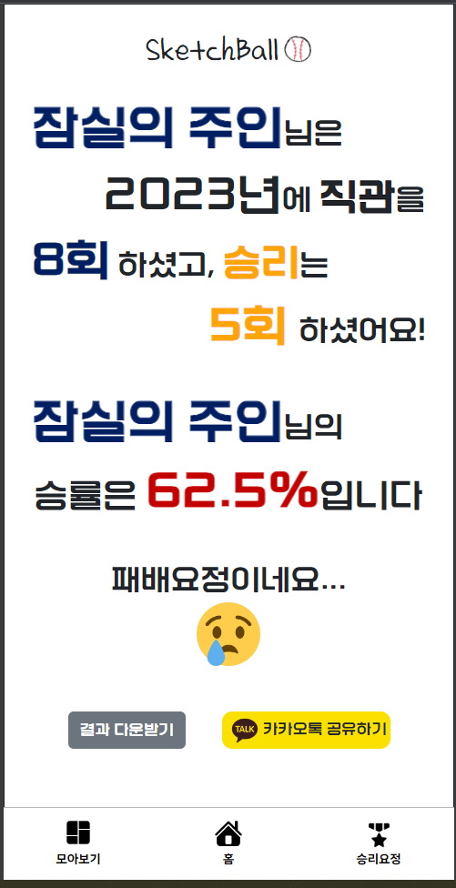](https://github.com/ssafy10-seoul07/PJT-FINAL-E-KJE-JHA/assets/128502524/4a22d78a-8465-40cb-8c1b-3176d558c206)

⭐ User

## 아키텍쳐

### 디렉토리 구조

**Back-end**

```
📂 BaseballDiary
   ㄴ 📂 src/main/java
      ㄴ 📂 com.diary
        ㄴ 📂 config
            ㄴ 📄 DBConfig.java
            ㄴ 📄 SwaggerConfig.java
            ㄴ 📄 WebConfig.java
        ㄴ 📂 controller
            ㄴ 📄 DiaryController.java
            ㄴ 📄 UserController.java
        ㄴ 📂 model
            ㄴ 📂 dao
                ㄴ 📄 DiaryDao.java
                ㄴ 📄 UserDao.java
            ㄴ 📂 dto
                ㄴ 📄 Diary.java
                ㄴ 📄 GameResult.java
                ㄴ 📄 UploadFile.java
                ㄴ 📄 User.java
                ㄴ 📄 VictoryFairy.java
            ㄴ 📂 service
                ㄴ 📄 DiaryService.java
                ㄴ 📄 DiaryServiceImpl.java
                ㄴ 📄 UserService.java
                ㄴ 📄 UserServiceImpl.java
        ㄴ 📄 BaseballDiaryApplication.java
   ㄴ 📂 src/main/resources
      ㄴ 📂 mappers
        ㄴ 📄 diaryMapper.xml
        ㄴ 📄 userMapper.xml
```

**Front-end**

```
📂 vue-baseballDiary-project
   ㄴ 📂 ...
   ㄴ 📂 src
      ㄴ 📂 assets
      ㄴ 📂 components
        ㄴ 📂 common
            ㄴ 📄 TheFooterNav.vue
        ㄴ 📂 diary
            ㄴ 📄 DiaryDetail.vue
            ㄴ 📄 DiaryUpdate.vue
            ㄴ 📄 DiaryWrite.vue
        ㄴ 📂 home
            ㄴ 📄 HomeCalendar.vue
            ㄴ 📄 HomeDetail.vue
            ㄴ 📄 HomeProfile.vue
        ㄴ 📂 home
            ㄴ 📄 Login.vue
            ㄴ 📄 SignUp.vue
            ㄴ 📄 UserDetail.vue
            ㄴ 📄 UserUpdate.vue
    ㄴ 📂 router
        ㄴ 📄 index.js
    ㄴ 📂 stores
        ㄴ 📄 diary.js
        ㄴ 📄 user.js
    ㄴ 📂 views
        ㄴ 📄 HomeView.vue
        ㄴ 📄 ListView.vue
        ㄴ 📄 OverallView.vue
        ㄴ 📄 StartView.vue
        ㄴ 📄 UserView.vue
        ㄴ 📄 VictoryView.vue
    ㄴ 📄 App.vue
   ㄴ ...
```

### 주요 기능 코드

- **이번주 날짜 생성**

```java
DiaryController.java

	// 날짜 보여주기
	@ApiOperation(value = "이번주를 출력")
	@GetMapping("/calendar")
	public ResponseEntity<String[]> getThisWeek() {

		// 세션 실행

		Calendar cal = Calendar.getInstance();
		int toYear = cal.get(Calendar.YEAR);
		int toMonth = cal.get(Calendar.MONTH);
		int toDay = cal.get(Calendar.DAY_OF_MONTH);

		cal.set(toYear, toMonth, toDay);
		int dayOfTheWeek = cal.get(Calendar.DAY_OF_WEEK);

		if (dayOfTheWeek != Calendar.SUNDAY) {
			dayOfTheWeek = dayOfTheWeek - 2;
		} else {
			dayOfTheWeek = 6;
		}

		toDay = toDay - dayOfTheWeek;

		for (int i = 0; i < 7; i++) {
			cal.set(toYear, toMonth, toDay + i);

			// Handle month and year rollover
			if (toDay + i < 1) {
				cal.add(Calendar.MONTH, -1);
				toMonth = cal.get(Calendar.MONTH);
				toYear = cal.get(Calendar.YEAR);

				int lastMonthMaxDay = cal.getActualMaximum(Calendar.DAY_OF_MONTH);
				toDay = lastMonthMaxDay + (toDay + i);
			}

			week[i] = cal.get(Calendar.YEAR) + "-" + (cal.get(Calendar.MONTH) + 1) + "-"
					+ (cal.get(Calendar.DAY_OF_MONTH));
		}

		return new ResponseEntity<String[]>(week, HttpStatus.OK);

	}

```

- **일기가 있는 날 스탬프 표시**

```js
diary.js;

//스탬프 가져오기
const stamp = ref([]);
const getStamp = function (userId) {
  axios
    .get(`${REST_DIARY_API}/calendar/stamp/${userId}`)
    .then((res) => {
      stamp.value = [];
      for (let i = 0; i < res.data.length; i++) {
        stamp.value.push(res.data[i].split("-")[2]);
      }
    })
    .catch((err) => {
      console.log(err);
    });
};
```

- **승리요정 분석**

```sql
diaryMapper.xml

SELECT
		d.userId,
		u.nickname,
		date_format(NOW(),'%Y') as year,
		COUNT(CASE WHEN d.userId=#{userId} AND d.isStadium=1 THEN 1 END) as totalCount,
		COUNT(CASE WHEN d.isStadium=1 AND d.result=1 THEN 1 END) as
		winningCount,
		ROUND((COUNT(CASE WHEN d.isStadium=1 AND d.result=1 THEN 1 END) / COUNT(CASE WHEN
		d.userId=#{userId} AND d.isStadium=1 THEN 1 END)) * 100, 1) as percent
		FROM
		user u
		LEFT JOIN
		diary d ON u.id = d.userId AND d.userId = #{userId} AND
		date_format(d.gamedate,'%Y') = date_format(NOW(),'%Y')
		WHERE
		u.id = #{userId};
```

- **화면 캡쳐 후 이미지 다운로드**

```js
VictoryView.vue;

import html2canvas from "html2canvas";

//다운받기
const downloadClicked = () => {
  html2canvas(document.querySelector("#capture")).then((canvas) => {
    canvas.toBlob((blob) =>
      navigator.clipboard.write([new ClipboardItem({ "image/png": blob })])
    );
    let uri = canvas.toDataURL("image/jpg");

    saveImg(uri, "image.jpg");
  });
};

const saveImg = (uri, filename) => {
  let link = document.createElement("a");

  document.body.appendChild(link);

  link.href = uri;
  link.download = filename;
  link.click();

  document.body.removeChild(link);
};
```

- **카카오톡 공유하기**

```js
index.html

 <script
      src="https://t1.kakaocdn.net/kakao_js_sdk/2.5.0/kakao.min.js"
      integrity="sha384-kYPsUbBPlktXsY6/oNHSUDZoTX6+YI51f63jCPEIPFP09ttByAdxd2mEjKuhdqn4"
      crossorigin="anonymous"
    ></script>
    <script>
      Kakao.init(/*사용하려는 앱의 JavaScript 키 입력*/);
    </script>

VictoryView.vue;

// 카톡 공유
const kakaoShare = () => {
	Kakao.Share.createDefaultButton({
		container: "#kakaotalk-sharing-btn",
		objectType: "feed",
		content: {
			title: "SketchBall⚾",

			imageUrl:
				"https://kr-mb.theepochtimes.com/assets/uploads/2021/02/6331661e12fa5ad97b73fe3897eef0d6-395x400.jpg",
			link: {
				webUrl: "http://localhost:5173",
			},
		},
		social: {
			likeCount: 286,
			commentCount: 45,
			sharedCount: 845,
		},
		buttons: [
			{
				title: "웹으로 보기",
				link: {
					webUrl: "http://localhost:5173",
				},
			},
		],
	});
};
```

## 소감

### 김지은

SpringBoot와 Vue로 처음부터 만들어 보는 프로젝트였기 때문에 처음에는 막연한 걱정이 됐다. 과연 Vue를 내가 할 수 있을지 두려웠기 때문이다. 그렇지만 지구 최고의 페어인 현아 언니가 Vue 작업 때 많이 도와줘서 함께 무사히 프로젝트를 완성할 수 있었다.

**기능 관련 소감**
구현할 때 기억에 남는 기능이 3가지가 있다.

1. 이미지 업로드
   File 업로드 부분을 배울 때 어려워서 최대한 피하고 싶었지만 일기 서비스를 하면 사진 업로드는 필수이기 때문에 즐기기로 했다. 하루가 걸려서 결국 성공해 냈다. 사진 저장 폴더 생성, 업로드된 사진을 Diary 객체와 함께 백으로 보내기 부분에 막혔다. 저장 폴더는 Path 객체와 .resolve() 메서드를 사용해서 유저 아이디명으로 새로 생성해서 담는 것에 성공했다. 백으로 객체는 JS의 FormData 객체를 사용해 Multipart/file 형태로 img, diary 키값을 각각 준 후 담아 백으로 보냈다.
2. 주간 달력 생성
   v-calendar을 사용하려고 했지만, 커스텀하는 시간이 오래 걸릴 것 같아 결국 직접 제작했다. v-calendar처럼 주를 앞뒤로 옮길 수는 없지만, 이번 주는 주가 바뀔 때마다 잘 보이기 때문에 만족스럽다.
3. 카카오톡 공유하기
   이번 프로젝트에서 유일한 API이다. 원래는 화면을 캡처해 그 화면을 카톡에 보내려고 했지만, 화면을 imgur에 업로드하는 API가 계속해 실행되지 않아 앱 아이콘을 보내는 것으로 대체했다.

5개월 동안 배운 지식을 총망라하며 한 프로젝트였기 때문에 나의 부족한 점을 알아가며 성장한 좋은 기회였다.

### 정현아

처음으로 서비스 기획부터 개발까지 하는 프로젝트를 하게 되었는데 최고의 페어 덕분에 생각보다 큰 어려움 없이 진행되었다. 자유롭게 의견을 내면서 수많은 의견 충돌이 있었는데 더 좋은 결과물을 만들기 위해 거쳐야 했던 필수 과정이었고, 이로 인해 팀워크가 더 단단해진 기분이 들었다. 또한 백과 프론트를 모두 경험해 볼 수 있는 프로젝트였기 때문에 vue나 spring 등 모르는 부분을 직접 찾아 보면서 개발 능력이 향상된 것 같다.

**기능 구현 소감**

1. 전체적인 파일 구성

   - 처음 명세서 작성할 때 Vue의 view, component를 모두 정해놓고, router 주소도 모두 정했다. 물론 프로젝트를 진행하면서 계속해서 수정을 했었지만 초기에 전체적으로 한 번 짜놨기 때문에 큰 어려움 없이 수정하며 진행할 수 있었다. 저번 관통 프로젝트 때도 느꼈지만 대략적인 틀을 짜 놓는 게 중요하다고 느꼈다.

2. 홈 캘린더 및 다이어리 연결

   - 우리가 만들 서비스의 가장 핵심이라고 할 수 있는 홈 화면의 캘린더와 해당 날짜의 다이어리 연결 부분의 백을 지은이가 했고, 프론트는 내가 담당했는데 여기서 프론트도 백을 알아야 한다는 사실을 직접 실감했다. V-calendar를 사용하지 않고 자바 내장 함수인 calendar를 이용해서 직접 알고리즘을 짜서 만들었기 때문에 백에서 가져오는 데이터를 가공하는데도 시간이 꽤 걸렸다. 그리고 이 부분 CSS할 때도 험난한 과정을 겪었다. 최대한 목업과 비슷하게 만들고 싶어서 테이블을 div로 바꿔보다가 결국 테이블 형태로 css를 완성했다 또한 home 화면을 실행했을 때 오늘 날짜인 부분에만 active css가 적용되게 하였고 다른 날짜를 클릭 할 경우 바뀌게 하는 알고리즘을 짤 때 복잡하게 했지만 그래도 잘 짠 것 같다.

3. 홈 화면 onMounted

   - 홈 화면(HomeView)의 주소는 /overall/home이고 이 안에 HomeDetail이 라우터뷰로 보여진다. HomeDetail의 주소는 /overall/home/:daily인데 HomeCalendar의 날짜를 클릭하면 HomeDetail이 보여져야 했기에 이를 백에서 가져온 데이터로 처리를 했으나 처음 Home 화면을 들어갈 때 HomeDetail 화면이 안 나오는 경우가 생겨서 HomeDetail 화면에서 onMounted를 했으나 적용되지가 않아서 HomeView에서 onMounted로 바로 /overall/home/:daily로 router.push 했더니 실행이 잘 됐다. 라우터에 대해 확실히 더 알게 되었다.

4. 모아보기

   - 이 부분도 백을 지은이가 했고 프론트를 내가 담당해서 백이 어떻게 돌아가는지 전부 확인하며 연결을 했다. 그리고 디버깅 하면서 발견한 내용은 모아보기 필터를 할 때 1월부터 12월을 배열로 돌리면서 select에 넣었는데, 백에서 받아오는 데이터가 01월, 02월… 이런 식이어서 한 자리 월을 필터 할 때 제대로 작동하지 않았다. 그래서 month가 10 미만일 경우 달 앞에 ‘0’을 덧붙여서 보냄으로써 오류를 고칠 수 있었다. 생각하지 못한 것에서 오류가 난다는 것을 깨닫고 더 자잘하게 디버깅을 해야겠다고 생각했다.

5. 이미지 업로드, 다운로드, 카카오톡 공유하기
   - 여기에 대해서는 페어인 지은이에게 코드리뷰를 하며 듣고 이해하긴 했지만 직접 해 보는 거랑 이해만 하는 거랑은 많이 다르다고 생각해서 추후에 천천히 다시 코드를 뜯어보거나 따로 직접 해 볼 예정이다.

## 기타

### COMMIT RULES

| **태그**        | **설명**                                                                    |
| --------------- | --------------------------------------------------------------------------- |
| Feat            | 새로운 기능을 추가한 경우                                                   |
| Fix             | 에러를 수정한 경우                                                          |
| Design          | CSS 등 UI 디자인을 변경한 경우                                              |
| BREAKING CHANGE | 중대한 API를 변경한 경우                                                    |
| HOTFIX          | 급하게 치명적인 에러를 고친 경우                                            |
| Style           | 코드 포맷 변경을 하거나 세미 콜론 누락하여 추가하면서 코드 수정이 없는 경우 |
| Refactor        | 코드를 리팩토링한 경우                                                      |
| Comment         | 주석을 추가하거나 변경한 경우                                               |
| Docs            | 문서를 수정한 경우                                                          |
| Test            | 테스트 코드를 추가, 변경, 리팩토링한 경우                                   |
| Chore           | 기타 변경사항 (빌드 스크립트 수정, 패키지 매니징 설정 등)                   |
| Rename          | 파일 or 폴더명 수정하거나 옮기는 경우                                       |
| Remove          | 파일을 삭제하는 작업만 수행한 경우                                          |

- << 태그 >> : << 요약 메시지 >> 형식으로 작성합니다.
- 제목의 처음은 동사 원형으로 시작합니다.
- 문장의 끝에 특수문자는 삽입하지 않습니다. 예) ., !, ?
